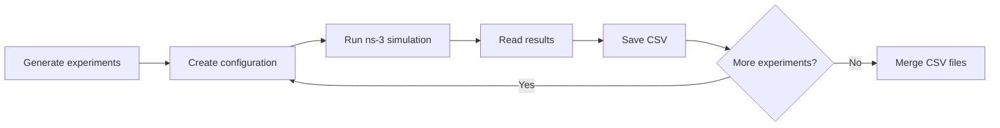

# Surrogate Model

Thesis project for automating ns-3/5G-LENA simulations and developing surrogate models from the results.

## n8n workflow

The workflow creates experiment configurations, runs simulations through SSH, checks for errors and saves the results as CSV files.

[View or download the workflow JSON](n8n/workflows/simulation-pipeline.json) · [Setup instructions](n8n/README.md)

The initial workflow runs three distances: **50, 100 and 150 m**, with UE power **10 dBm** and offered load **20 Mbps**. Each experiment has its own configuration, results and CSV file.

## Current progress

- Automated simulation and CSV generation are working.
- Python scripts for Gaussian Process training and validation are included separately; integration with the n8n dataset is pending.
- Physics-informed models and VAE synthetic-data generation are planned next stages.
