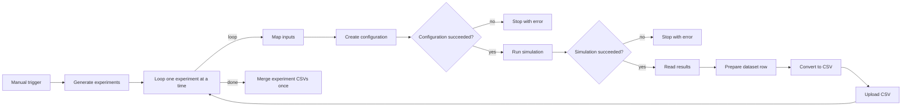

# Thesis simulation pipeline

An n8n workflow automates three ns-3/5G-LENA experiments, preserves each configuration and result, and exports a combined CSV for subsequent surrogate modelling.

**Current n8n scope:** simulation data generation. The repository already contains separate Python GP and validation scripts at its root; they are not connected to this workflow. Integration with those scripts, physics-informed TensorFlow models, a connected digital twin, VAE generation and final workflow validation are future work. No LLM agents are used in this workflow.

The root GP script expects features including gNB transmit power and multiple UE counts. This workflow varies UE transmit power for a single UE. Its CSV cannot be passed directly to that script, and UE power must not simply be relabelled as gNB power. Feature selection and units must be reconciled before integration.

## Workflow



| Experiment | UE distance (m) | UE power (dBm) | Offered load (Mbps) | Seed | RNG run |
| --- | ---: | ---: | ---: | ---: | ---: |
| distance_50m | 50 | 10 | 20 | 42 | 1 |
| distance_100m | 100 | 10 | 20 | 42 | 1 |
| distance_150m | 150 | 10 | 20 | 42 | 1 |

The scenario has one stationary UE, one gNB, and one UDP CBR uplink flow to a cloud host. It uses scalar Friis path loss, no shadowing or fading, isotropic antennas and RLC UM. The full baseline is in `simulation/dag.example.json`.

## Files

- `workflows/simulation-pipeline.json`: sanitized n8n export; SSH credentials must be assigned after import.
- `simulation/default-nr-scenario.cc`: scenario source snapshot.
- `simulation/dag.example.json`: baseline configuration snapshot.
- `docs/results.md`: observed pilot results and their limitations.
- `docs/export-review.md`: export changes and checks.

## Requirements and setup

1. Prepare ns-3.47 with a compatible, working 5G-LENA NR module, a C++ toolchain, Python 3, and the `nlohmann/json.hpp` header. This repository is not a complete simulator distribution. The exact NR commit and n8n version used for the pilot were not recorded; pin them before a formal reproducibility study.
2. Place the scenario at `<NS3_ROOT>/scratch/default/default-nr-scenario.cc` and copy `dag.example.json` to `<NS3_ROOT>/scratch/default/dag.json`. Keep only one source containing `main()` in that directory when using the default scratch CMake discovery.
3. Configure and build the scenario. Use `./ns3 show targets` to inspect the registered name. In the tested default-profile installation, the launcher exposed this scenario as `scratch/default/nr-scenario` because its name normalization removes `-default`. Verify this alias in your installation and update the Run simulation node if necessary. The workflow uses `--no-build`, so rebuild after changing C++.
4. Start an SSH server on the simulation host and create an SSH credential in n8n for an account with access to the simulator directory. Verify network reachability from the n8n container. A WSL IP can change after restart.
5. Import `workflows/simulation-pipeline.json` into n8n. Assign your credential to all five SSH nodes: Create configuration, Run simulation, Read results, Save CSV and Merge experiment CSVs.
6. In the four command SSH nodes, replace `/ABSOLUTE/PATH/TO/ns-3.47` in Working Directory with your actual absolute simulator root. Save CSV derives its destination from the current experiment; do not replace that expression.
7. Keep Loop Over Items batch size at 1 and Merge experiment CSVs **Execute Once** enabled. Run the entire workflow from the manual trigger, without pinned execution data.

## Output

```text
<NS3_ROOT>/experiments/execution_<n8n-id>/
  experiment_1/config.json
  experiment_1/results.json
  experiment_1/distance_50m_exec_<n8n-id>.csv
  experiment_2/...
  experiment_3/...
  batch_dataset.csv
```

Each CSV row contains experiment identity, provenance paths, selected input parameters, packet counters and performance metrics. The configuration JSON preserves inputs that are not flattened into the CSV.

| Metric | Definition |
| --- | --- |
| `throughput_mbps` | Received IP bytes × 8 / application duration / 1e6; includes IP/UDP headers and packets received during drain. |
| `app_goodput_mbps` | Received application payload bytes × 8 / application duration / 1e6. |
| `end_to_end_delay_ms` | Mean IP-level delay of received packets, UE to cloud. |
| `jitter_ms` | FlowMonitor absolute consecutive delay differences summed and divided by received packets minus one. |
| `loss_fraction` | (Transmitted minus received packets) / transmitted packets after drain; may include packets still queued. |

Undefined delay/jitter values remain null before CSV conversion; a missing value is not zero. IP throughput may exceed the configured application load because of protocol headers.

## Operational limitations

- The merge command explicitly expects these three experiments. Update both generator and merge logic before expanding the campaign.
- Existing experiment directories and merged CSVs cause an error rather than being overwritten. Start a new full workflow execution for a new batch. Execution IDs are local to an n8n installation; a reset or a second installation sharing the same output root can collide.
- IF nodes stop the workflow on nonzero configuration/simulation exit codes. Dataset preparation additionally checks command results, single-flow output and distance/power/load consistency. Seed and RNG run in the CSV come from configuration creation, not independent simulator output verification.
- The merge node returns a remote exit code. A green SSH node alone does not prove the merge succeeded: check `code == 0`. A dedicated merge-exit IF gate has not yet been added.
- Input validation uses Python assertions; do not run with Python optimization enabled. Treat the export as a research prototype, not a hardened public service.
- These three samples demonstrate orchestration and are insufficient for training and assessing a useful surrogate.

## Sharing and attribution

Credentials, simulator build products and local experiment directories are intentionally excluded. Importers must provide their own SSH credentials and host paths. Keep backups of n8n storage and experiment data separately from this workflow export.

No new license is assigned in this review package. Determine the appropriate license and attribution for the scenario and any upstream-derived code before public redistribution. Dependencies retain their own licenses.
