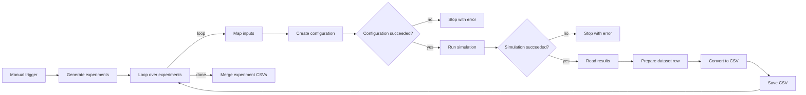

# Thesis simulation pipeline

An n8n workflow that runs ns-3/5G-LENA experiments through SSH and collects the results into a CSV dataset for future surrogate modelling.

## Workflow

```mermaid
flowchart LR
    A[Manual trigger] --> B[Generate experiments]
    B --> C[Loop over experiments]
    C -->|loop| D[Map inputs]
    D --> E[Create configuration]
    E --> F{Configuration succeeded?}
    F -->|no| X[Stop with error]
    F -->|yes| G[Run simulation]
    G --> H{Simulation succeeded?}
    H -->|no| Y[Stop with error]
    H -->|yes| I[Read results]
    I --> J[Prepare dataset row]
    J --> K[Convert to CSV]
    K --> L[Save CSV]
    L --> C
    C -->|done| M[Merge experiment CSVs]
```

[View or download the n8n workflow](workflows/simulation-pipeline.json)

## Current experiments

The workflow runs three experiments at UE distances of **50, 100 and 150 metres**, with UE transmit power of **10 dBm**, offered load of **20 Mbps**, seed **42** and RNG run **1**.

Each experiment saves its configuration, simulation results and CSV file. The three rows are combined into `batch_dataset.csv`, including throughput, goodput, delay, jitter and packet loss.

## Setup

Import the workflow JSON into n8n, assign your SSH credentials to the five SSH nodes, and replace `/ABSOLUTE/PATH/TO/ns-3.47` in the command nodes with your simulator directory. The simulation host needs a working ns-3/5G-LENA installation and a built scenario matching the Run simulation command.

Keep the loop batch size at **1** and **Execute Once** enabled for Merge experiment CSVs. Start each batch from the manual trigger. The generator and merge command currently expect three experiments.

## Supporting files

- [Simulation source](simulation/default-nr-scenario.cc)
- [Example configuration](simulation/dag.example.json)
- [Pilot results](docs/results.md)
- [Workflow export notes](docs/export-review.md)

The current workflow generates simulation data. Connecting it to the repository's surrogate modelling scripts is a next step.
