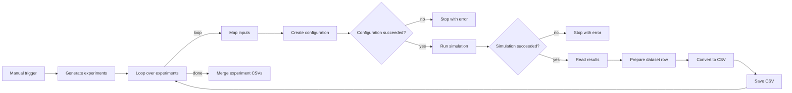

# Thesis simulation pipeline

An n8n workflow that runs ns-3/5G-LENA experiments through SSH and collects the results into a CSV dataset for future surrogate modelling.

## Workflow

```mermaid
flowchart LR
    A[Manual trigger] --> B[Generate experiments]
    B --> C[Loop over experiments]
    C -->|loop| D[Map inputs]
    D --> E[Create configuration]
    E --> F{Configuration succeeded?}
    F -->|no| X[Stop with error]
    F -->|yes| G[Run simulation]
    G --> H{Simulation succeeded?}
    H -->|no| Y[Stop with error]
    H -->|yes| I[Read results]
    I --> J[Prepare dataset row]
    J --> K[Convert to CSV]
    K --> L[Save CSV]
    L --> C
    C -->|done| M[Merge experiment CSVs]
```

[View or download the n8n workflow](workflows/simulation-pipeline.json)

## Workflow nodes

| Node | What it does |
| --- | --- |
| When clicking ‘Execute workflow’ | Starts the workflow manually. |
| Generate experiments | Creates the list of experiments and their input parameters. |
| Loop Over Items | Processes one experiment at a time and finishes after all experiments have run. |
| Edit Fields | Maps the current experiment's parameters to the fields used by the next nodes. |
| Create configuration | Uses SSH to create the experiment folder and write its simulation configuration. |
| Configuration succeeded | Checks the configuration command's exit code and routes failures to Stop and Error. |
| Stop and Error | Stops the workflow if configuration creation fails. |
| Run simulation | Runs ns-3/5G-LENA through SSH using the generated configuration. |
| Simulation succeeded | Checks the simulation command's exit code and routes failures to Stop and Error1. |
| Stop and Error1 | Stops the workflow if the simulation fails. |
| Read results | Reads the simulation's JSON results through SSH. |
| Prepare dataset row | Checks the results and combines input parameters and performance metrics into one dataset row. |
| Convert to File | Converts the dataset row into a CSV file with column headers. |
| Save CSV | Uploads the CSV to the experiment folder and returns to the loop for the next experiment. |
| Merge experiment CSVs | Combines the individual experiment CSVs into batch_dataset.csv after the loop finishes. |
